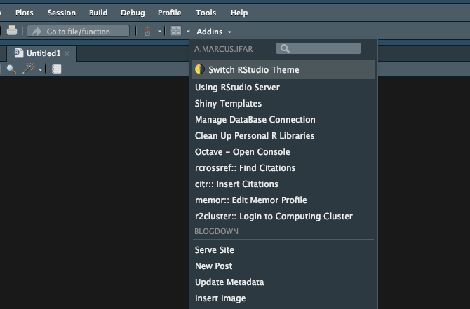
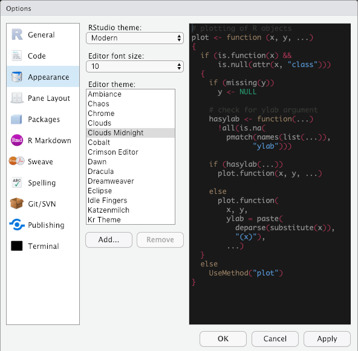

```{r setup, include=FALSE}
options(htmltools.dir.version = FALSE)
```

class: center, middle, inverse

Links

Slides: [http://bit.ly/rstudioaddin19](http://bit.ly/rstudioaddin19)

Code Example: [http://bit.ly/addindemo19](http://bit.ly/addindemo19)

---

# A Little about us and our infrastructure

- Marcus Institute for Aging Research: Harvard-affiliated Research Group about Aging in Boston 
  
- Data team size: 10-15
  
- R Infrastructure:

  - Self-hosted RStudio Server + Connect
  
  - We use shared R libraries but personal packages are allowed.

---



---

# Some Facts about RStudio Addin

- Announced in early 2016

- Goal: Provide convenience to regular RStudio users

- Capacity:

    - Interact with **RStudio IDE** through [`rstudioapi`](https://github.com/rstudio/rstudioapi)
    
    - Interactive User Interface through [`shiny`](https://github.com/rstudio/shiny)
    
    - Access various web services through API & [httr](https://github.com/r-lib/httr)

- RStudio Addins need to be delivered by R packages. One R package can hold multiple addins

---

# In this talk

- Provide an overview of how to create an addin

- Present Addins that we created at work on our RStudio Server

- Present a few use cases that RStudio Addins can greatly enhance our productivities
    - Reference management through [`rcrossref`](https://github.com/ropensci/rcrossref) + [`citr`](https://github.com/crsh/citr)
    
    - Remote Cloud Computing Connection through [`r2cluster`](https://github.com/hebrewseniorlife/r2cluster)

- Share some thoughts we have about integrating RStudio Addins with Processes at work

---

class: center, middle

# Let's start!

---

# Example #1: Between Dark & Light

.center[

]


???

Image credit: [beyondyourmind](https://funnyjunk.com/channel/wallpapers/A+collision+of+dark+and+light/pLstDcY/)

---



---

# Create RStudio Addin - Step 1

> To the end, addins are just R functions.

--

```{r}
rstudioapi::getThemeInfo()
```

--

```{r}
current_theme <- rstudioapi::getThemeInfo()
next_theme <- ifelse(current_theme$dark, "Clouds", "Clouds Midnight")
next_theme
```

---

# Create RStudio Addin - Step 1

> To the end, addins are just R functions.

```{r}
switch_theme <- function() {
  current_theme <- rstudioapi::getThemeInfo()
  next_theme <- ifelse(current_theme$dark, "Clouds", "Clouds Midnight")
  rstudioapi::applyTheme(next_theme)
}
```

Put this function somewhere in the `R` folder.

---

# Create RStudio Addin - Step 2

> RStudio has to know the existence of this addin.

--

In **`inst/rstudio/addins.dcf`**, declare this addin.


```
Name: 🌗 Switch RStudio Theme
Description: Toggle RStudio Server Theme between Dark and Light
Binding: switch_theme
Interactive: false
```

Binding links the Addin Button with `switch_theme`. 


---

# Minimal RStudio Addin Structure

```
- DESCRIPTION
- R/
    - my_addins.R
- inst/
    - rstudio/
        - addins.dcf
```

.center[
## Only 3 files!
]

---

# Example #2: Bookmarks

- Use cases

  - Server specific documentation
  
  - Personal Use
  
- Guess how long the code look like?

--

```{r, eval=F}
open_server_guide <- function() {
  rstudioapi::viewer("https://ifar-connect.hsl.harvard.edu/using_rstudio_server/")
}
```

---

# Example #3: Setup Favorite Addins

- "Hi, RStudio, here is a Feature Request if possible 😆"

- For now, you can re-export awesome addins from other packages

- How?

```{r}
open_xaringan <- function() {
  xaringan:::inf_mr()
}
```

---

# Example #4: Reference Management: rcrossref + citr

- [rcrossref](https://github.com/ropensci/rcrossref) by [rOpenSci](https://github.com/ropensci)

- [citr](https://github.com/crsh/citr) by [Frederik Aust](https://github.com/crsh)

---

# Other Addin IdUse Case
- Manage ODBC Connections: Open up hidden file `.odbc.ini`.
- Open up Octave in Terminal
- [`r2cluster`](https://github.com/hebrewseniorlife/r2cluster)


---
 
# Take home messages

--

- ### Creating an RStudio Addin is really `r kableExtra::text_spec("easy", bold = T, color = '#D9230F')` and `r kableExtra::text_spec("fun", bold = T, color = '#D9230F')`!

--

- Addin is a great tool for personal use. 
  - If you have never created an R package, don't be afraid and make your 1st one today!
  
--

- Addin is a great tool for teams to standardize practices!

---

#Credits

.left-column[
- Fredrick Kinyua [@kamanufred](https://github.com/kamanufred)

- Tim Tsai [@timothytsai](https://github.com/timothytsai)

- Tom Travison [@tgt2](https://github.com/tgt2)

- We gratefully acknowledge support from the NIA via a Boston Pepper Center (P30AG031679, PI: S Bhasin) Core Development Project Grant to TG Travison
]

.right-column[

]

